# YOU□ME

#### 闘病中のペットのきろくをつけることを目的としたアプリです。
YOU□MEは文章や写真等で記録をつけるアプリです。
ブログやツイッターのように文章、写真を公開することや、自分が振り返る為のきろくや日記として公開せずに使うこともできます。  

### アプリの機能一覧
- ログイン機能  
- 投稿機能
- 画像アップロード  
- ページネーション機能  
- いいね機能（灯をともす）
- タグ  
- 検索
### 使用してる技術一覧
##### サーバサイド
ruby 2.5.7  
rails  5.2.4
##### Gem
devise（ログイン機能）   
refile(画像アップロード)  
refile-mini_magick(画像投稿機能)  
pry-byebug(デバッグ)  
ransack(検索)  
js(非同期通信)(無限スクロール)  
kaminari(ページネーション)  
simple_calendar（カレンダー）  
rails-i18n（言語の変換）  
##### フロントエンド
CSSフレームワーク(bootstrap-sass)  
Flexbox(cssレウアウト)  
sass-rails(SASS)  
##### 本番サーバ環境
AWS(EC2,RDS,EIP)
##### データベース
MySQL
##### WEBサーバ
Nginx

### 使い方
 
- 『トイレ』『おみず』『ごはん』『元気』の４つの項目についてラジオボタンの○△✕から選択して手軽に記録をつけることができます。
また、写真や文章の記録もつけることができます。  
<記録投稿画面>
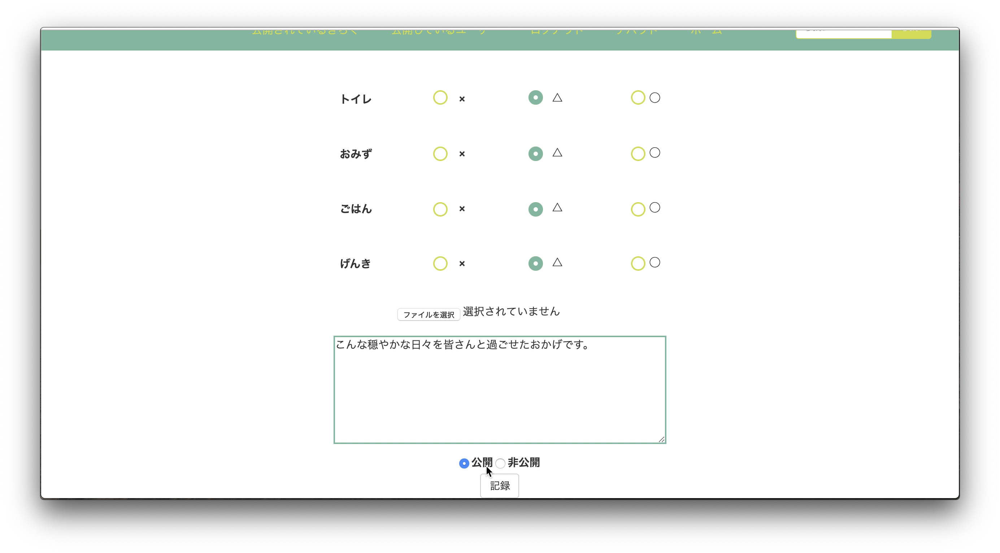

- つけたきろくの写真や文章の公開、非公開の選択ができます。(上の図『記録投稿画面』下部にあるボタンで選択)  
<非公開に設定された時の記録の詳細画面>
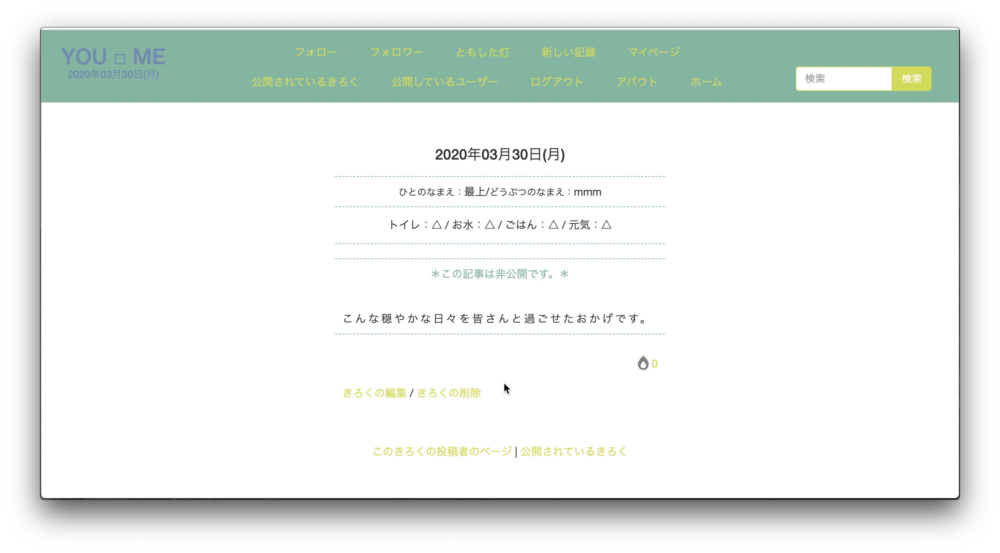
<『公開されているきろく』画面から表示が消えます>
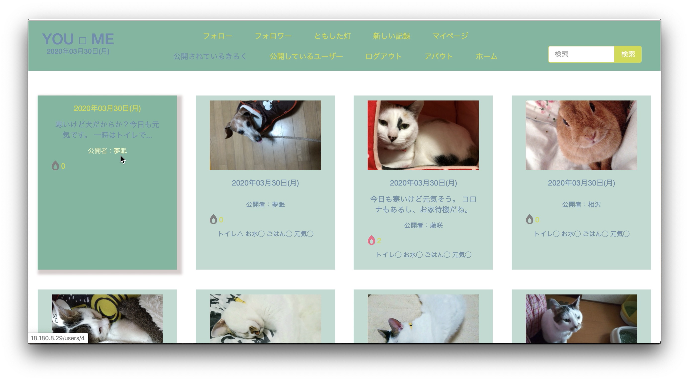

- ユーザー情報の公開、非公開の選択ができます。  
<非公開に設定>
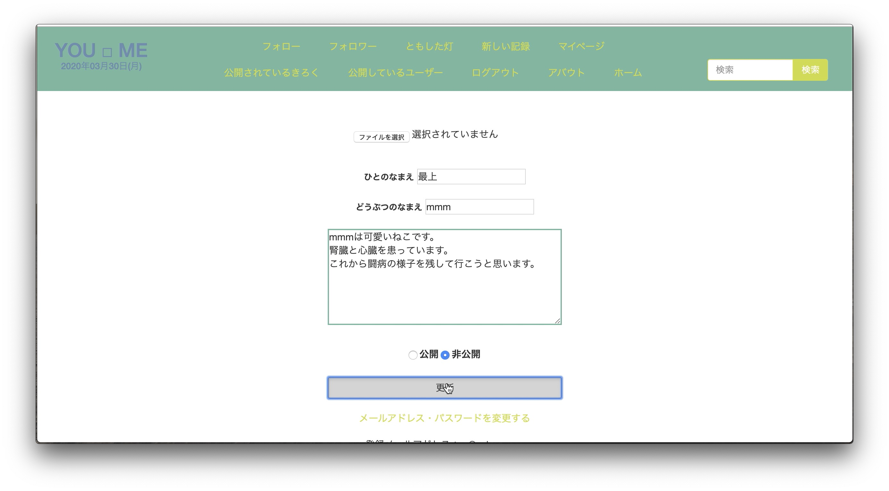
<非公開に設定された時のマイページ>
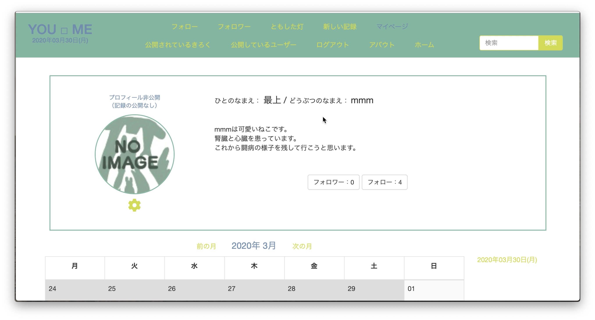
<『公開しているユーザー』画面から表示が消えます>
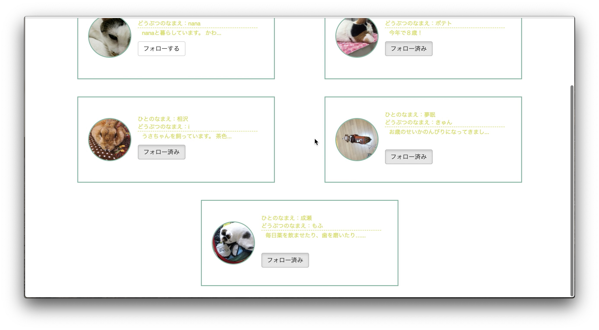

- 気に入った記録には灯をともすことができます。  
<灯をともす>
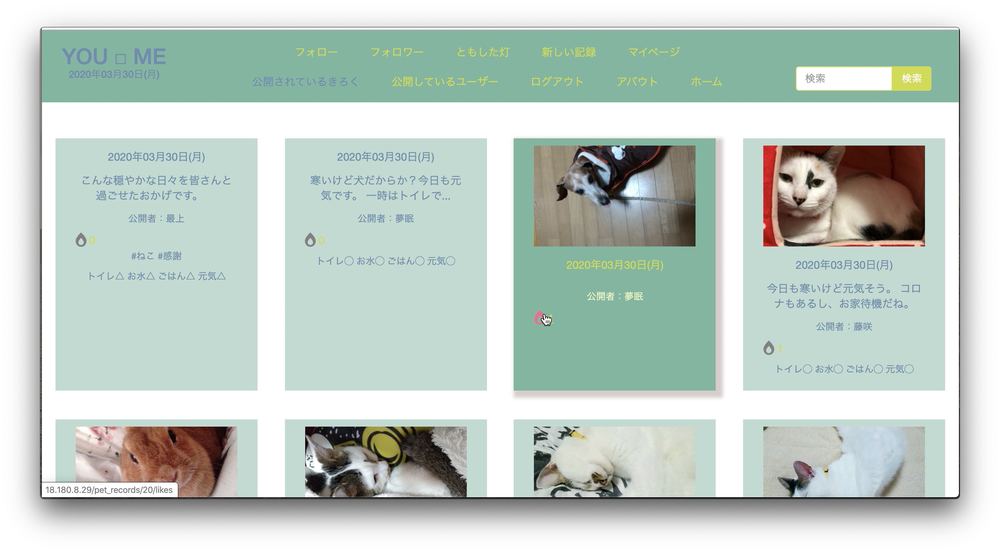
<（ユーザーが公開状態になっている場合は）灯をともした記録にともしたユーザーのアイコンが出ます>
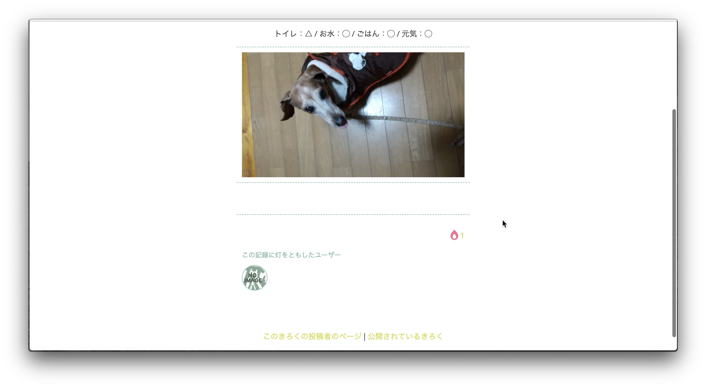

- 気に入ったユーザーをフォローできます。  
<他のユーザーのページ等からフォローが可能>
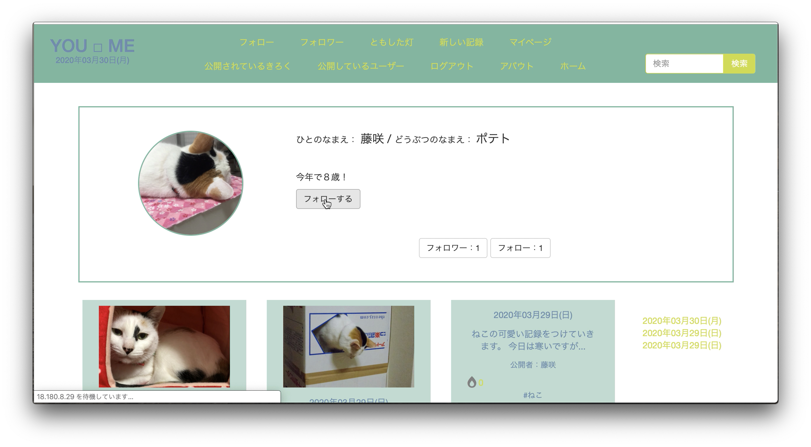

- 検索機能やタグ機能で目的のきろくを探せます。  
<タグ機能>
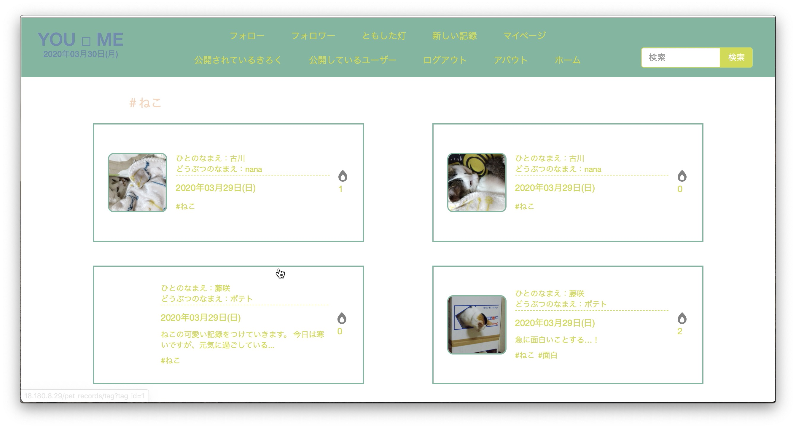
<検索機能>
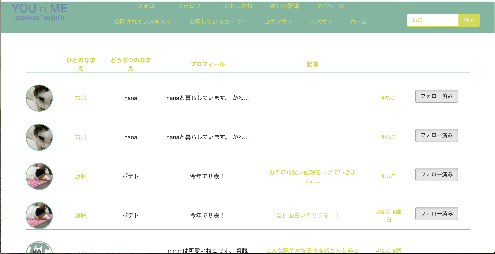

#### アプリの名前の由来
YOUは公開された記録をみる”あなた”であり、ペットの”きみ”のこと、   
MEは記録をつける本人の”私”です。  
その間には、何が入ってくるでしょう。
あなたと私間に少しでも楽しさや嬉しさが入るよう、情報共有したり、向き合ったり…このアプリがその助けになればと思います。
